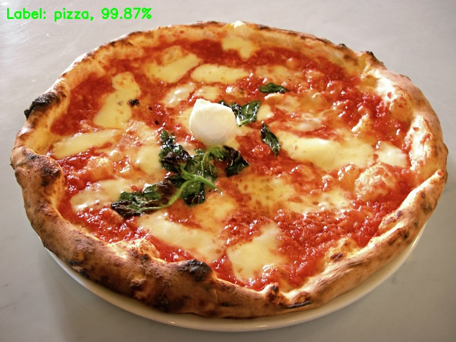
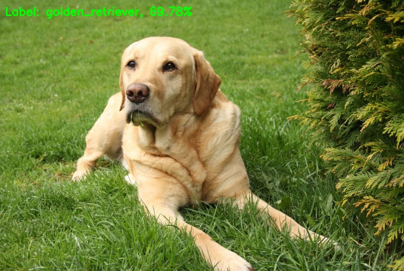

# Image-Classification-Imagenet-Keras-Python

** If you want to display and save the predicted output image **
> python imagenet_test.py --image images/desktop.jpg --output output/desktop_predict1.jpg

** If you want to only display predicted output image **
> python imagenet_test.py --image images/desktop.jpg

## Examples

